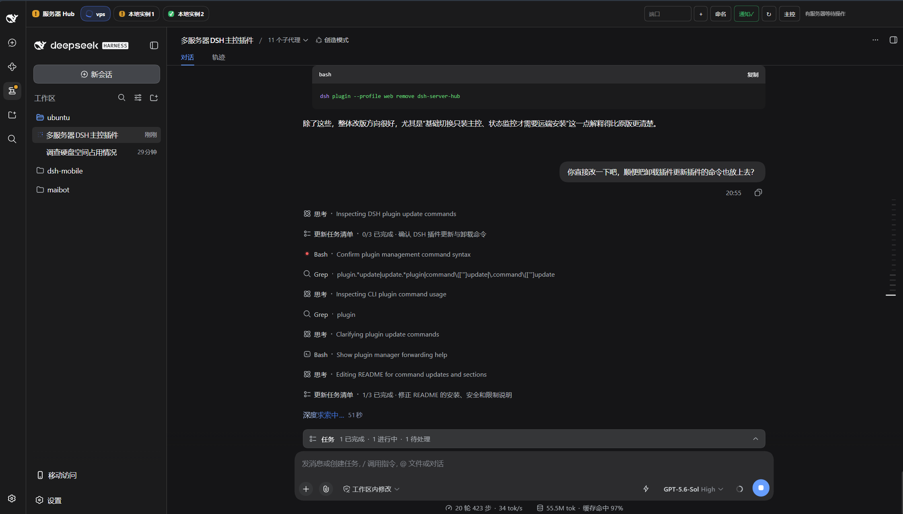
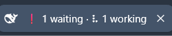

# 🚀 DSH Server Hub

<p align="center">
  <strong>专为 DeepSeek Harness Web 打造的多实例 / 多服务器统一控制台与状态雷达</strong>
</p>

<p align="center">
  <a href="https://github.com/ginkgonine/dsh-server-hub/releases"></a>
  <a href="https://github.com/deepseek-ai/deepseek-harness"></a>
  <a href="https://nodejs.org"></a>
  <a href="./LICENSE"></a>
</p>

---

## 💡 DSH Server Hub 解决哪些问题？

当你在**本地并行开发多个项目**，或在**多台远程 GPU/开发服务器**上同时跑 [DeepSeek Harness (DSH)](https://github.com/deepseek-ai/deepseek-harness) 任务时，常常被两件事困扰：

1. **“标签页地狱”**：浏览器里开了一整排 DSH 网页，所有 Tab 都千篇一律叫“DeepSeek Harness”，每次找项目或机器都得抓周；切换时还会伴随页面重载与白屏闪烁。
2. **“盲盒式巡检”**：离开网页后，你根本不知道哪个实例的 Agent 跑完了、哪台正卡在**“等待人工授权/提问”**环节，只能隔一会儿挨个切回去肉眼翻查。

**DSH Server Hub** 将本地运行的所有 DSH 实例以及通过隧道转发到本机的远程 DSH 节点，全部聚合进同一个原生工作台中。**自动识别端口、单页无感热切、全矩阵 Agent 状态雷达与全局被动唤醒**，让你在一个窗口内从容调度全部算力与会话。

> 📌 **按需安装，轻重随心**：
> * **基础多实例/多服切换（Hub）**：**仅需在本地主控端安装！** 其它本地实例或远端服务器无需任何插件，只要端口在本机处于监听状态，即可立刻享受单页聚合与多标签切换；
> * **全景状态雷达与提醒**：如果你想在标签栏、浏览器 Tab 和桌面弹窗上实时看到各个实例的 Agent 运行状态（是否正在运行、是否卡在等待授权），只需在对应实例上也安装该插件即可。

---

## 🖼️ 界面预览



浏览器标签页会跟随多服务器 Agent 状态自动变化：

| 工作中 | 等待人工操作 | 已完成 |
| :---: | :---: | :---: |
|  |  |  |

---

## ✨ 核心特性

### 🔍 自动感知，开箱即用 (Zero-Config Auto Discovery)
* **智能本地扫描**：原生探测跨平台（Windows / Linux / macOS）的本机 TCP 监听端口，自动识别本机启动的其他 DSH 实例或通过 SSH 隧道映射到本机的实例，免去繁琐配置。
* **灵活补充 & 个性命名**：支持手动追加指定端口；支持给每台实例/服务器自定义直观名称（如 `本地-电商重构`、`A100-训练机`、`4090-测试节点`），配置持久化保存于浏览器本地，重启不丢。

### ⚡ 无缝热切，零白屏闪烁 (Seamless Hot Switching)
* **常驻 Iframe 后台热载**：所有实例在后台保持挂载，切换标签时不会主动重新加载，上下文、聊天记录与输入框草稿均可保留。
* **深色模式体验调优**：内置平滑过渡与暗色防闪烁机制，彻底告别 iframe 切换时的刺眼白屏。

### 🧭 全矩阵 Agent 状态雷达 (Status Radar)
各实例的 Agent 动向尽收眼底，一眼看透全局进度：
* 🏃 **正在工作**：工具调用与推理进行中（Hub 标签显示旋转指示器，提示活跃任务数）
* ❗ **等待确认**：Agent 卡在危险操作授权或需要人工输入（琥珀色高亮呼吸，优先提醒）
* ✅ **任务完成**：任务闭环结束，状态即时同步
* 💤 **空闲 / 离线**：清晰区分就绪与连接中断状态

### 📑 浏览器标签页智能同步 (Smart Browser Tab)
无需切回网页，看一眼浏览器 Tab 标题就能洞察一切：
* 🏃 **有任务在跑**：浏览器 Tab 标题前缀显示**动态旋转字符**（`⠋` ➔ `⠙` ➔ `⠹` ➔ `⠸`...），直观感知后台仍在全力运转；
* ❗ **需要人工介入**：只要有任意一个实例卡在等待授权，Tab 标题立刻醒目标注彩色 `❗`；
* ✅ **任务圆满完成**：有实例产生新的任务完成状态后，自动呈现 `✅` 提示交付。

### 🔔 全局桌面被动唤醒 (Desktop Notifications)
* **精准桌面弹窗**：在需要人工授权或任务结束时，主动推送到系统通知中心，不同事件类型区分弹窗提示。写代码或摸鱼时不再需要频繁肉眼巡检，有事它会自动叫你。
* **全生命周期守护**：即使你暂时切出 Hub 面板回到普通聊天窗口，底层的监控器依然在后台静默运行，保证提醒不漏接。

---

## 📐 架构与工作拓扑

```text
┌─────────────────────────────────────────────────────────────────┐
│  本地工作站 (Windows / macOS / Linux PC)                         │
│                                                                 │
│   DSH 主控 Web ── 侧栏入口: [服务器 Hub]                          │
│   │                                                             │
│   ├── 聚合标签 [主控本机] [本地项目B] [A100训练机] [测试节点]    │
│   │                                                             │
│   └── 常驻监控调度器 (Host + Client Overlay)                     │
│         │ (每30s自动扫描端口 / 约每1.5s轻量状态轮询)             │
│         │                                                       │
│         ├── 127.0.0.1:3001 (本机另一个项目目录跑的 DSH)         │
│         │                                                       │
│         ├── 127.0.0.1:3101 (SSH 隧道) ── 远程服务器 A (带插件)  │
│         │                                                       │
│         └── 127.0.0.1:3102 (SSH 隧道) ── 远程服务器 B (纯 DSH)  │
└─────────────────────────────────────────────────────────────────┘
```

---

## 🚀 极速上手

### 步骤 1：安装插件

#### 1. 本地主控端（必选）
在作为主控的 DSH 实例上安装，启用 Hub 面板与智能发现：

```bash
dsh plugin --profile web add github:ginkgonine/dsh-server-hub
dsh web
```

#### 2. 被监控端（可选）
如果希望监控某个实例（本地或远程）的 Agent 工作/等待/完成状态，在该实例上也执行安装并重启对应的 DSH Web：

```bash
dsh plugin --profile web add github:ginkgonine/dsh-server-hub
# 停止旧进程后重新启动
dsh web
```

*(被 Hub 嵌入时会自动切换为纯后台轻量桥接模式，不产生冗余 UI)*

### 步骤 2：启动更多实例（本机多开 或 远程隧道）

无论是本地多开还是远程映射，只要端口在本地处于监听状态，Hub 都会自动发现：

* **方式 A：本机多实例并行（多项目开发）**
  在另一个项目目录中，以指定端口启动第二个 DSH：
  ```bash
  cd ~/another-project
  dsh web --port 3001
  ```

* **方式 B：远程服务器映射（多服务器集群）**
  通过 SSH 将远端 DSH 服务的端口映射到本地的独立端口：
  ```bash
  # 将远程服务器 A、B 分别映射到本地 3101 和 3102 端口
  ssh -N -L 3101:127.0.0.1:3080 user@server-a.internal
  ssh -N -L 3102:127.0.0.1:3080 user@server-b.internal
  ```

### 步骤 3：即刻掌控

1. 打开主控 DSH Web 页面，在左侧导航栏点击 **「服务器 Hub」**；
2. 插件会自动探测到刚才启动或映射的所有本地端口，并生成标签页；
3. 点击 **「命名」** 为每个实例设置易记别名（如 `本地-前端重构`、`A100-训练`）；
4. 点击工具栏的 **「通知」** 授予浏览器通知权限，激活桌面弹窗；
5. 开启高能并行开发！

---

## ⚙️ 常用操作与配置

| 操作 | 说明 |
| :--- | :--- |
| **切换实例** | 点击顶部标签，即开即切，各实例上下文与草稿均完整保留 |
| **命名实例** | 选中标签后点击「命名」，输入自定义别名（持久化于本地浏览器缓存） |
| **手动添加端口** | 若使用了特殊端口或未自动列出，在输入框填写端口号并回车即可直连 |
| **桌面通知授权** | 点击工具栏「通知」按钮，浏览器授权后生效，等待操作与任务完成均有专属弹窗 |
| **返回主控会话** | 点击工具栏「主控」或左侧普通会话即可离开 Hub，后台监控依然在浏览器 Tab 标题与通知中生效 |

### 更新插件

在主控以及已安装状态桥接的被监控端分别执行：

```bash
dsh plugin --profile web update dsh-server-hub
```

更新后停止旧进程并重新运行 `dsh web`。如果主控与远端暂时没有同时更新，已有的 v1 状态协议仍可继续通信，但建议最终保持版本一致。

### 卸载插件

```bash
dsh plugin --profile web remove dsh-server-hub
```

卸载后同样需要重启对应的 DSH Web。远端卸载后仍可在 Hub 中打开，但不再提供 Agent 状态和通知；主控卸载后 Hub 入口会消失。

---

## 🔒 安全与网络设计

* **零会话隐私侵入**：状态桥接端只返回约每 1.5 秒轮询一次的轻量聚合状态（当前工作任务数、等待确认数、完成事件序列号等），不传输聊天记录、提示词、工具参数或输出日志。
* **分层访问控制**：扫描和状态总览 API 使用 DSH 的登录校验；供主控 Host 轮询的 `/api/dsh-server-hub/status` 仅接受无浏览器 `Origin` 的 Loopback GET/HEAD 请求（`127.0.0.1` / `::1`）。
* **反向代理提醒**：不要把状态桥接端点放在会将外部请求转换成 Loopback 来源的本机反向代理后面；如确有需要，应在代理层额外配置身份验证和访问控制。
* **低负载防护**：
  * 状态响应体最大读取 16 KiB，HTTP 探测超时为 1.2 秒且禁止跟随重定向；
  * 端口探测并发数限制为 24，探测范围上限 256 个本机监听端口；
  * 手动添加端口上限 64 个，且仍限定为 Loopback HTTP。

---

## ⚠️ 已知限制

* 自动扫描发生在**主控 DSH 进程所在的机器**。如果主控运行在 Linux 服务器上，它无法看到浏览器所在 Windows PC 的本地隧道端口。
* 自动探测仅访问 `127.0.0.1` 和 `::1` 上的 HTTP 服务；仅绑定其他网卡地址、HTTPS 或任意完整 URL 的场景暂不支持。
* 目标 DSH 必须允许 iframe 嵌入。若响应包含 `X-Frame-Options: DENY` 或严格的 CSP `frame-ancestors`，需调整代理响应头或采用主控反向代理方案。
* 未安装插件的实例仍可打开和切换，但不提供 Agent 状态、浏览器标题汇总和桌面通知。
* 桌面通知必须由用户点击「通知」主动授权；若曾拒绝，需要在浏览器站点设置中恢复权限。

---

## 🛠️ 开发者指南

本项目已包含预构建的发布产物（位于 `lib/`）。构建过程完全基于标准 ESM 与 DSH 模块规范，不依赖闭源私有工具链。

```bash
# 1. 克隆代码仓库
git clone https://github.com/ginkgonine/dsh-server-hub.git
cd dsh-server-hub

# 2. 构建与运行测试
npm run build
npm test
npm run check

# 3. 安装本地源码版本至 DSH
dsh plugin --profile web add .
```

### 目录结构

```text
├── src/
│   ├── index.js        # Host 端：端口智能发现、极轻状态桥接、常驻监控与受保护 API
│   └── client.js       # Client 端：Slot 注入、iframe 容器组、状态动效与通知控制
├── lib/                # 预编译产物目录
├── cordis.patch.yml    # Web profile 插件描述补丁
└── scripts/build.mjs   # 轻量构建脚本
```

---

## 📄 开源许可证

本项目基于 [MIT 许可证](LICENSE) 开源。
